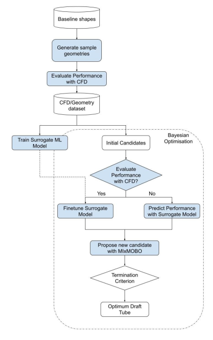
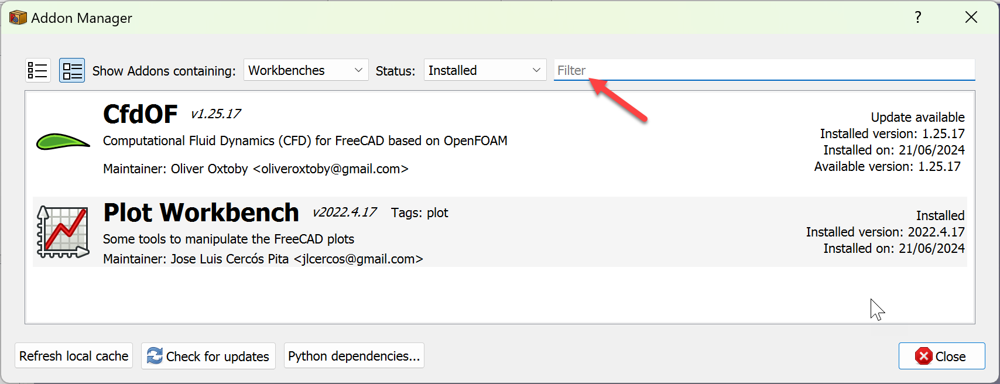
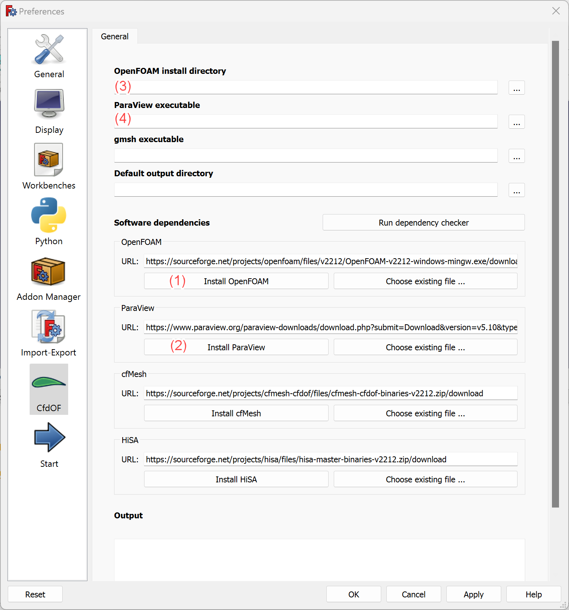

# Optimising Design with Simulation-Based Bayesian Optimisation (OPSIDIAN)

## Introduction
The design process generally involves the following steps: modelling, analysis, and refinement. The initial modelling stage generally uses an overdesigned proposal. From here, it is up to the engineer to optimise the design by considering factors such as performance, cost, and construction time through iterative analysis and refinement procedures. The analysis step is crucial in this procedure and usually consists of Computational Fluid Dynamics (CFD) simulations or Finite Element Analysis (FEA) simulations. This calculates the performance metrics of a design and is the basis on which the design is optimised. Analysis is an expensive process. This presents opportunities to utilise machine learning to accelerate this process. Specifically, using surrogate models to predict simulation outcomes and Bayesian Optimisation to achieve optimal design efficiently. 
Key issues lie in the complexity of geometric representation and parameterisation. Examples include the curse of dimensionality with increasing variables describing a geometry or the fact that many parametric approaches can also lead to invalid design (Sikirica et al. 2024).
This research aims to create a novel framework for efficient design optimisation by integrating simulation-based analysis, surrogate models, and Bayesian Optimisation with te following workflow:  
  

## Prerequisites
To run this code please download FreeCAD and follow the instructions to setup OpenFOAM and ParaView.
1. FreeCAD: [Download Link](https://www.freecad.org/downloads.php)
2. Launch FreeCAD and download required addons:
    - Go to **Tools > Addon manager**   
    - Locate the **CfdOF** and **Plot Workbench** addons and install them.  
      
3. Download and setup OpenFOAM and ParaView:
    - Go to **Edit > Preferences**
    - Open the **CfdOF** ribon
    - Install OpenFoam (1)
    - Install ParaView (2)  
    - Locate and add OpenFoam directory (3) e.g. _"C:/Program Files/ESI-OpenCFD/OpenFOAM/v2212"_
    - Locate and add ParaView directory (4) e.g. _"C:/Program Files/ParaView 5.10.1-Windows-Python3.9-msvc2017-AMD64/bin/paraview.exe"_  
      

## Getting Started

To get started, follow these steps:

1. **Clone Repository**
2. Open FreeCAD and open python console through **View > Panels > Python console**
3. Run script by copying and pasting the following commands to the FreeCAD Python console (Update DIR with the path to the directory containing the OPSIDIAN folder):
```
DIR = 'path to the directory containing the OPSIDIAN folder'  
exec(open(f'{DIR}/src/main.py').read())  
```

